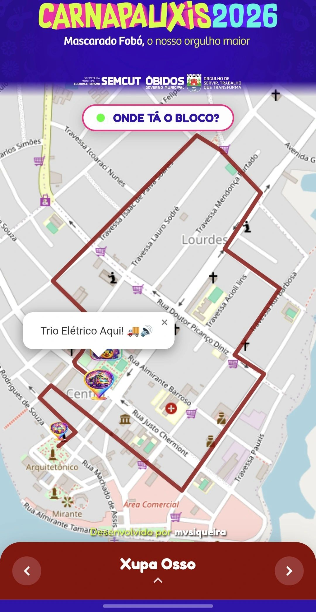
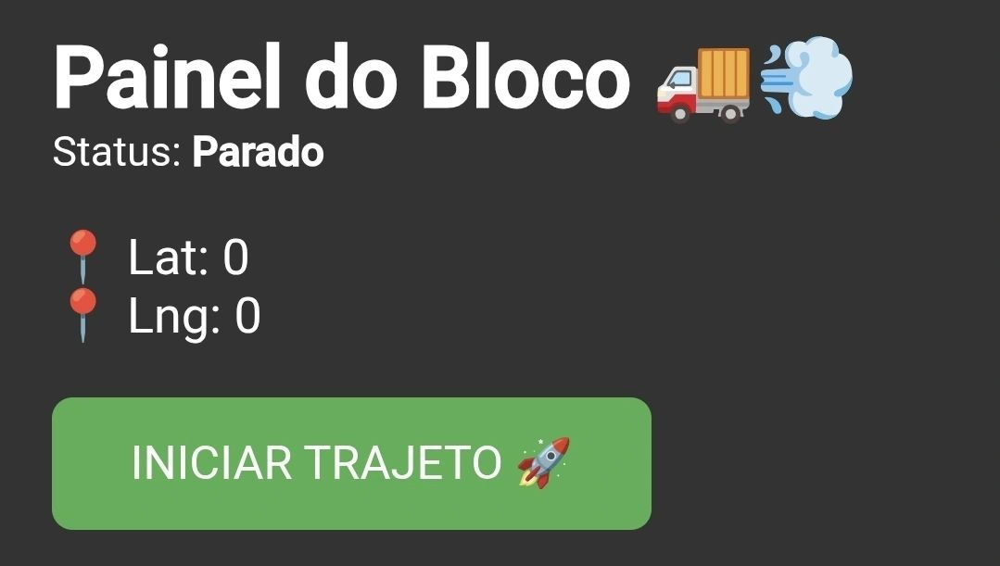

# 🚚 Onde o Bloco Tá? - CarnaPauxis 2026

> **"Tecnologia conectando tradição e folia na Amazônia."**

## 🏆 Resultados e Impacto
Projeto desenvolvido e utilizado durante o **CarnaPauxis 2026** (Carnaval de Óbidos/PA). Em apenas 7 dias de evento, a aplicação alcançou:

- 🚀 **+76.000 Acessos** únicos.
- 🗺️ Monitoramento em tempo real de **7 blocos oficiais**.
- 📱 Alta estabilidade com picos de usuários simultâneos.

---

## 📱 Sobre o Projeto

O **Onde o Bloco Tá?** é uma aplicação web (PWA) de utilidade pública. O objetivo era resolver um problema real: localizar o trio elétrico e o trajeto dos blocos em meio à multidão.

O sistema permite que qualquer usuário acesse a localização exata do trio (GPS), visualize o trajeto desenhado no mapa e confira a programação do dia, identificando automaticamente qual bloco está desfilando.

### ✨ Funcionalidades

* **Rastreamento em Tempo Real:** Localização GPS via Supabase Realtime.
* **Mapas Interativos:** Rotas oficiais desenhadas (Polylines) sobre o mapa da cidade.
* **Lógica de Data:** O app identifica o dia atual e carrega o bloco correspondente automaticamente.
* **Painel Administrativo:** Interface restrita com *Wake Lock API* para impedir que a tela apague durante a transmissão do GPS.

---

## 📸 Screenshots

| Visão do Folião (Mobile) | Painel Admin (GPS) |
|:-------------------------:|:--------------------:|
|  |  |

---

## 🛠️ Stack Tecnológica

- **Frontend:** [React.js](https://reactjs.org/) + [Vite](https://vitejs.dev/)
- **Mapas:** [React Leaflet](https://react-leaflet.js.org/) + OpenStreetMap
- **Backend & Realtime:** [Supabase](https://supabase.com/) (PostgreSQL)
- **Deploy:** [Vercel](https://vercel.com/)

---

## ⚙️ Link para entrar no site

https://carnapauxis-rastreio.vercel.app/#
